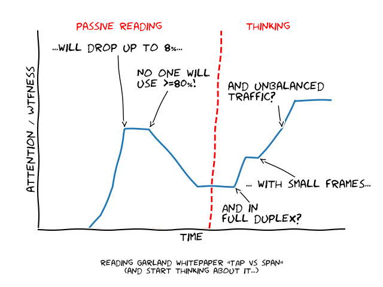

# preface

I'm aware that the following text looks like an advertisement for network TAPs or the company Garland at all. 

To make it clear: I'm not related to Garland in any way. 

I was just interested in the statement they published. I worked in the field of industrial security and up to now 
I trusted the mirror ports more or less *blindly* (at least in the common use case: copy traffic from the cell level to some kind of application).


# introduction

Most solutions I have seen focusing on security in Industry 4.0 for manufacturing systems relay on network data collected close to the process level (what else should they do ¯\\\_(ツ)_/¯).

A typical hierarchical structured manufacturing automation systems utilize different kind of Ethernet switches on different levels, e.g.
- **shop floor level**: shop floor supervisory & control @ 1 GBit/s
- **cell control level**: cell coordination - data collection & 
machine control @ 100 MBit/s
- **process control level**: sensor and actor coordination - data collection & machine control @ 100 MBit/s

Up to the cell level most systems using fast Ethernet (100 Mbit/s) in full duplex. Normally one CPU/PLC is connected by one switch. The same switch connects the PLC to the lower (actors/sensors - real world IO) and upper levels (plant control) of the system.
This turns the port that connects the switch to the PLC to ***the*** access point for industrial security solutions (provided that the security concept denies direct access from the higher levels to the IO-level - if not one would need to capture the traffic on those connections too).

Usually those 'cell control level' switches (e.g. SIEMENS Scalance 200*)offer basic management functions and the option to copy all traffic (RX and TX) from one port to another (mirror resp. span) port - so network traffic could be collected easily. 

I used the phrase *could* cause Chris Greer from [Packet Pioneer](https://packetpioneer.com/) did some mirror port performance tests and Garland (a company developing, producing and selling network TAPs) published some numbers based on those test in their [blog](https://www.garlandtechnology.com/2014/06/16/the-test-span-vs-tap). 
The key message: if you are going to use mirroring you will loose up to *8 (!!!) percent* of your frames under high load conditions. Strong words if your are selling TAP devices.
   
The numbers as given as in the blog entry:
- 100 MBit/s link (on a CISCO Catalyst switch)
- traffic generated using [iperf](https://iperf.fr/), link saturated at 93.1 Mbps - 11637500 bytes / s (~11 MByte/s)
- test runs for 10 seconds
- total of 133126 frames captured by the TAP (13312 per second)
- 11637500 bytes/s / 13312 frames/s => 874 byte average frame size



Of course - we had some discussions about the pros/cons of using mirror ports... ...but we never thought it to the end neither we did some simple and clean tests.

But the statement made by Garland - true or not - has a big impact on the way ~we~ one could integrate Industry 4.0 security solutions on the field level. Beside the technical aspects this also affects the TCO as most systems offer the mirror ports for free - for the TAP based integration one would need the TAP devices, some space in the cabinets, additional power supplies, maintenance...

\*) SIEMENS is just an example - there are other companies too when it comes down to industrial network equipment. Check MOXA, Hirschmann, Weidmüller, CISCO, Beckhoff Automation, Rockwell Automation, Schneider Electric ... .    list is not exhaustive

# first view & arising questions & assumptions 

The switch in the test setup used by Chris was pushed to the limits. Fact: Using Ethernet links with a saturation >80% is commonly considered as bad practise.  

*Question_1:* How does the mirror behave below saturation? Is there a bandwidth limit below no drops occur or is the mirror dropping frames all the time? 

*Assumption:* There is a hard bandwidth limit but it depends on the individual frame size and utilization of all links feeding the mirrored port. 

Nowadays most Ethernet based systems are running in full duplex.

*Question_2:* What happens if we not just saturate one direction? What happens if we send enough traffic up- and downstream to a single mirrored port so the mirror can't handle the traffic cause the sum of both stream exceeds the mirror ports TX-bandwidth? 

*Assumption:* Sending close to 50% of the traffic from and to the mirrored port is fine. But above this limit the mirror will drop.
 
*Question_3:* What happens if the up/down traffic from/to the mirrored port shows asymmetric bandwidth (e.g. mirrored port sends 20Mbit/s - while 3 other ports are sending downwards to the same port using 15 Mbit/s)? 

*Assumption:* Well, maybe we will see drops earlier cause of the asymmetric utilization of the backplane...

iperf uses a traffic pattern we would not expect in industrial environments, especially in (close to) realtime applications. There is no statement what protocol (TCP/UDP) was used - but from the avg frame size 
way below usual MTU I guess they used TCP (50% MTU sized frames, 50% ACKs of ~70 byte). To my knowledge (gathered by running statistics over big traces collected on the shopfloor in different companies) the average frame size in automation systems is ~130 bytes.

*Question_4:* How is the function of the mirror affected, if we use 64, 128, 256, ... MTU sized frames?  

*Assumption:* Its likely that small frames cause bigger trouble as the gap between the frames of different links to be forwarded is smaller.

# test setup

## iperf

In the whitepaper presented by Garland iperf was used to create an overload situation to measure the drop between mirrored and mirror link.
  
I also did the iperf benchmark to get the bandwidth limit of the switches in comparision to the number presented by Garland.

YFTR - you can use network namespaces to avoid any fiddling with iptables when running iperf on two local interfaces, e.g.:
  
```
ip netns add ns_server
ip netns add ns_client
ip link set eth0 netns ns_server
ip link set eth1 netns ns_client
ip netns exec ns_server ip addr add 10.0.0.1/24 dev eth0
ip netns exec ns_client ip addr add 10.0.0.2/24 dev eth1
ip netns exec ns_server ip link set dev eth0 up
ip netns exec ns_client ip link set dev eth1 up
ip netns exec ns_server iperf3 -s
<in a second terminal>
ip netns exec ns_client iperf3 -c 10.0.0.1

<delete namespaces when done>
ip netns del ns_server
ip netns del ns_client
```

## mirror test 

I used the Ostinato Network Traffic Generator (version 0.8) and its Python interface to build an automated test rig that offers
- up to 7 ports for injecting traffic,
- 1 capture port and 
- a pre-defined set of traffic patterns to be run automatically against each device.

The used hardware (Xeon E3-1231v3 @ 3.40GHz and 2x Silicom PEG4 - 8x BCM5704 @ 1Gbit/s) can handle TX/RX of the required 100Mbit/s streams easily
(but I added a check so in case not all requested frames are generated the tool will just explode).

Relevant scripts (part of this repo):

|name | function|
|-----|---------|
|switch_mirror_test.py | executes the test |
|plot_data.py | generates somehow meaningful graphs from the collected data |
|ipv6_support_ctrl.py | enable / disable IPv6 support for configured interfaces |
|interface_config.py | capture (RX) and injector (TX) interface configuration |
|traffic_config.py | traffic patterns to be tested | 

Check the help for options.

Before you can run the test
- adapt *interface_config.py* to your hardware,
- disable IPv6 support (got some spurious ICMPv6 & MDNSv6 messages - use *ipv6_support_ctrl.py*),
- adapt *traffic_config.py* to your needs and
- start Ostinato.

You must also disable all protocols/tasks/agents on the tested switches that would create network traffic (e.g. LLDP, MRP, CDP, STP, DTP, LOOP/keepalive).

## traffic patterns

|name                       |pattern                |
|---------------------------|-----------------------|
|single-mirrored            |   n-0                 |
|single-non-mirrored        |   0-n                 |
|dual-symmetric             |   n-n                 |
|dual-asymmetric            |   n-10                |
|quad-asymmetric-left       |   n-10-10-10          |
|quad-asymmetric-right      |   10-n-n-n            |
|quad-asymmetric-unbalanced |   10-n-(n+10)-(n+20)  |
|quad-1:3                   |   n-n-n-n             |

- first interface = mirrored interface, always sends to second interface (if configured)
- all other interfaces send frames to first interface 
- used frame sizes are: 64, 128, 130, 256, 512, 1024, 1500

## tested devices 

### Ruggedcom RS900

Known limitations (from RUGGEDCOM ROS v3.12 manual):
- Traffic will be mirrored onto the target port only if the target port is a member of the same VLANs as the source
port.
- The target port may sometimes incorrectly show the VLAN tagged/untagged format of the mirrored frames.
- Network management frames (such as STP, GVRP etc. ) may not be mirrored.
- Switch management frames generated by the switch (such as Telnet, HTTP, SNMP etc.) may not be mirrored.
 
iperf link saturation: ~94.4 Mbits/s

Mirror configuration: port 1 -> port 6

Results - plot:
- [rs900---dual-asymmetric.png](results/plots/rs900---dual-asymmetric.png)
- [rs900---dual-asymmetric.png](results/plots/rs900---dual-asymmetric.png)
- [rs900---dual-symmetric.png](results/plots/rs900---dual-symmetric.png)
- [rs900---quad-1:3.png](results/plots/rs900---quad-1:3.png)
- [rs900---quad-asymmetric-left.png](results/plots/rs900---quad-asymmetric-left.png)
- [rs900---quad-asymmetric-right.png](results/plots/rs900---quad-asymmetric-right.png)
- [rs900---quad-asymmetric-unbalanced.png](results/plots/rs900---quad-asymmetric-unbalanced.png)

### Ruggedcom RSG2100

iperf link saturation: ~93.8 Mbits/sec 

Mirror configuration: port 1 -> port 8

Results - plot:
- [rsg2100---dual-asymmetric.png](results/plots/rsg2100---dual-asymmetric.png)
- [rsg2100---dual-asymmetric.png](results/plots/rsg2100---dual-asymmetric.png)
- [rsg2100---dual-symmetric.png](results/plots/rsg2100---dual-symmetric.png)
- [rsg2100---quad-1:3.png](results/plots/rsg2100---quad-1:3.png)
- [rsg2100---quad-asymmetric-left.png](results/plots/rsg2100---quad-asymmetric-left.png)
- [rsg2100---quad-asymmetric-right.png](results/plots/rsg2100---quad-asymmetric-right.png)
- [rsg2100---quad-asymmetric-unbalanced.png](results/plots/rsg2100---quad-asymmetric-unbalanced.png)

### SIEMENS Scalance X208

Known limitations:
- can't mirror IRT traffic

iperf link saturation: ~93.9 Mbits/sec

Mirror configuration: port 1 -> port 8

Results - plot:
- [scalance208---dual-asymmetric.png](results/plots/scalance208---dual-asymmetric.png)
- [scalance208---dual-asymmetric.png](results/plots/scalance208---dual-asymmetric.png)
- [scalance208---dual-symmetric.png](results/plots/scalance208---dual-symmetric.png)
- [scalance208---quad-1:3.png](results/plots/scalance208---quad-1:3.png)
- [scalance208---quad-asymmetric-left.png](results/plots/scalance208---quad-asymmetric-left.png)
- [scalance208---quad-asymmetric-right.png](results/plots/scalance208---quad-asymmetric-right.png)
- [scalance208---quad-asymmetric-unbalanced.png](results/plots/scalance208---quad-asymmetric-unbalanced.png)

### SIEMENS Scalance X201 IRT

**TBD**

iperf link saturation: 

Mirror configuration: port -> port

### CISCO Catalyst 3550

iperf link saturation: 93.9 Mbits/sec

Mirror configuration: port 1 -> port 8

Results - plot:
- [catalyst3550---dual-asymmetric.png](results/plots/catalyst3550---dual-asymmetric.png)
- [catalyst3550---dual-asymmetric.png](results/plots/catalyst3550---dual-asymmetric.png)
- [catalyst3550---dual-symmetric.png](results/plots/catalyst3550---dual-symmetric.png)
- [catalyst3550---quad-1:3.png](results/plots/catalyst3550---quad-1:3.png)
- [catalyst3550---quad-asymmetric-left.png](results/plots/catalyst3550---quad-asymmetric-left.png)
- [catalyst3550---quad-asymmetric-right.png](results/plots/catalyst3550---quad-asymmetric-right.png)
- [catalyst3550---quad-asymmetric-unbalanced.png](results/plots/catalyst3550---quad-asymmetric-unbalanced.png)

### Mikrotik RB2011

iperf link saturation: 93.9 Mbits/sec

Mirror configuration: port ether6 -> port ether10, ether6 master of ether7..9

Results - plot:
- [rb2011---dual-asymmetric.png](results/plots/rb2011---dual-asymmetric.png)
- [rb2011---dual-asymmetric.png](results/plots/rb2011---dual-asymmetric.png)
- [rb2011---dual-symmetric.png](results/plots/rb2011---dual-symmetric.png)
- [rb2011---quad-1:3.png](results/plots/rb2011---quad-1:3.png)
- [rb2011---quad-asymmetric-left.png](results/plots/rb2011---quad-asymmetric-left.png)
- [rb2011---quad-asymmetric-right.png](results/plots/rb2011---quad-asymmetric-right.png)
- [rb2011---quad-asymmetric-unbalanced.png](results/plots/rb2011---quad-asymmetric-unbalanced.png)

# results

## numbers

Total speed (up+down) the mirror starts to drop per device / traffic pattern and selected frame sizes:

||rb2011|rsg2100|scalance208|catalyst3550|rs900|
|------|------|-------|-----------|------------|-----|
| dual-symmetric <br> (n-n)   |64: 80 Mbit/s<br>130: 90 Mbit/s<br>512: 100 Mbit/s<br>1500: 100 Mbit/s |64: 80 Mbit/s<br>130: 90 Mbit/s<br>512: 100 Mbit/s<br>1500: 100 Mbit/s |64: 80 Mbit/s<br>130: 90 Mbit/s<br>512: 100 Mbit/s<br>1500: 100 Mbit/s |64: 80 Mbit/s<br>130: 90 Mbit/s<br>512: 100 Mbit/s<br>1500: 100 Mbit/s |64: 80 Mbit/s<br>130: 90 Mbit/s<br>512: 100 Mbit/s<br>1500: 100 Mbit/s |
| dual-asymmetric <br> (n-10)   |64: 80 Mbit/s<br>130: 90 Mbit/s<br>512: 100 Mbit/s<br>1500: 100 Mbit/s |64: 80 Mbit/s<br>130: 90 Mbit/s<br>512: 100 Mbit/s<br>1500: 100 Mbit/s |64: 80 Mbit/s<br>130: 90 Mbit/s<br>512: 100 Mbit/s<br>1500: 100 Mbit/s |64: 85 Mbit/s<br>130: 90 Mbit/s<br>512: 100 Mbit/s<br>1500: 100 Mbit/s |64: 80 Mbit/s<br>130: 90 Mbit/s<br>512: 100 Mbit/s<br>1500: 100 Mbit/s |
| quad-asymmetric-unbalanced <br> (10-n-(n+10)-(n+20))   |64: 85 Mbit/s<br>130: 91 Mbit/s<br>512: 100 Mbit/s<br>1500: 100 Mbit/s |64: 85 Mbit/s<br>130: 91 Mbit/s<br>512: 100 Mbit/s<br>1500: 100 Mbit/s |64: 85 Mbit/s<br>130: 91 Mbit/s<br>512: 100 Mbit/s<br>1500: 100 Mbit/s |64: 85 Mbit/s<br>130: 91 Mbit/s<br>512: 100 Mbit/s<br>1500: 100 Mbit/s |64: 85 Mbit/s<br>130: 91 Mbit/s<br>512: 100 Mbit/s<br>1500: 100 Mbit/s |
| quad-asymmetric-right <br> (10-n-n-n)   |64: 85 Mbit/s<br>130: 91 Mbit/s<br>512: 100 Mbit/s<br>1500: 100 Mbit/s |64: 85 Mbit/s<br>130: 91 Mbit/s<br>512: 100 Mbit/s<br>1500: 100 Mbit/s |64: 85 Mbit/s<br>130: 91 Mbit/s<br>512: 100 Mbit/s<br>1500: 100 Mbit/s |64: 85 Mbit/s<br>130: 91 Mbit/s<br>512: 100 Mbit/s<br>1500: 100 Mbit/s |64: 85 Mbit/s<br>130: 91 Mbit/s<br>512: 100 Mbit/s<br>1500: 100 Mbit/s |
| quad-asymmetric-left <br> (n-10-10-10)   |64: 80 Mbit/s<br>130: 90 Mbit/s<br>512: 100 Mbit/s<br>1500: 100 Mbit/s |64: 80 Mbit/s<br>130: 95 Mbit/s<br>512: 100 Mbit/s<br>1500: 100 Mbit/s |64: 80 Mbit/s<br>130: 90 Mbit/s<br>512: 100 Mbit/s<br>1500: 100 Mbit/s |64: 80 Mbit/s<br>130: 90 Mbit/s<br>512: 100 Mbit/s<br>1500: 100 Mbit/s |64: 80 Mbit/s<br>130: 90 Mbit/s<br>512: 100 Mbit/s<br>1500: 100 Mbit/s |
| quad-1:3 <br> (n-n-n-n)   |64: 80 Mbit/s<br>130: 88 Mbit/s<br>512: 100 Mbit/s<br>1500: 100 Mbit/s |64: 88 Mbit/s<br>130: 88 Mbit/s<br>512: 100 Mbit/s<br>1500: 100 Mbit/s |64: 80 Mbit/s<br>130: 88 Mbit/s<br>512: 100 Mbit/s<br>1500: 100 Mbit/s |64: 88 Mbit/s<br>130: 88 Mbit/s<br>512: 100 Mbit/s<br>1500: 100 Mbit/s |64: 88 Mbit/s<br>130: 88 Mbit/s<br>512: 100 Mbit/s<br>1500: 100 Mbit/s |

There where no drops while running the patterns *single-non-mirrored* and *single-mirrored* - so if the switch is just fed by on TX link the mirror can handle the full bandwidth
(but this is a very unlikely scenario).

## Q&A

*Question_1:* How does the mirror behave below saturation? Is there a bandwidth limit below no drops occur or is the mirror dropping frames all the time? 

*Assumption:* There is a hard bandwidth limit but it depends on the individual frame size and utilization of all links feeding the mirrored port. 

***Answer_1:*** All tested devices show the same behaviour: above 80 Mbit/s you will loose frames on the mirror - no drops below the limit. 

*Question_2:* What happens if we not just saturate one direction? What happens if we send enough traffic up- and downstream to a single mirrored port so the mirror can't handle the traffic cause the sum of both stream exceeds the mirror ports TX-bandwidth? 

*Assumption:* Sending close to 50% of the traffic from and to the mirrored port is fine. But above this limit the mirror will drop.

***Answer_2:*** The sum of the bandwidths of all ports feeding the mirrored port counts. In a common automation system (shopfloor) with an avg. frame size of ~130 bytes the mirror can only handle 4 ports at ~22 Mbit/s (see quad-1-3 pattern).   
 
*Question_3:* What happens if the up/down traffic from/to the mirrored port shows asymmetric bandwidth (e.g. mirrored port sends 20Mbit/s - while 3 other ports are sending downwards to the same port using 15 Mbit/s)? 

*Assumption:* Well, maybe we will see drops earlier cause of the asymmetric utilization of the backplane...

***Answer_3:*** Seems there is a small diff between the *quad-asymmetric-right* and *quad-asymmetric-left* pattern - but its only ~5 Mbit/s or ~1 Mbit/s per port - nothing of relevance. Bandwidth distribution has no significant impact on the bandwidth the mirror port can handle.  

*Question_4:* How is the function of the mirror affected, if we use 64, 128, 256, ... MTU sized frames?  

*Assumption:* Its likely that small frames cause bigger trouble as the gap between the frames of different links to be forwarded is smaller.
 
***Answer_4:*** Small frames cause trouble. With 64 byte frames none of the tested devices is able to run @ 100 Mbit/s. But in most scenarios the mirror can handle up to 90 Mbit/s for frames with a size of 130 bytes- the common case in automation systems. Above 512 byte frame size the mirror is able to forward 100% of the traffic.  

# conclusion

The behaviour of mirror ports to drop traffic under non-overload conditions turned out to be a real issue - it's not just some kind of sales-biased tech-mumbo-jumbo show effect.

While running a single link >= 80% won't work in any way, running full-duplex links @ 40 Mbit/s in both directions is completely acceptable in terms of bandwidth utilization.

**You *can* use the mirror ports for building an Industry 4.0 security application if**
- bandwidth stays always way below 80% - in sum for all frames to be mirrored (TX of the mirrored port and sum(TX) all ports feeding the mirrored port) ***and***
- the network is (physically) secured so an intruder can't overload network links by injecting faked traffic to hide its own (malicious) traffic.

The second point is important - you won't be able to guarantee full protection by investing a reasonable amount of money. 

**You *must* use network TAPs if**
- the (peak/burst) network TX-utilization of the mirrored port is close to 80% or could reach this limit ***or***
- the system uses full duplex and the RX/TX-bandwidth in sum is >= 80 MBit/s ***or***
- you use small frames and traffic showing sporadic bursts (e.g. substation systems using IEC 61850 SMV combined with GOOSE traffic) ***or***
- your system uses Profinet IRT - as switches usually won't be able to use IRT and mirroring at the same time (provided they support PN IRT at all) ***or***
- you need to get defective frames (most switches running in cut through will forward them too - but this really depends on the switch model, configuration and type of the error) ***or***
- you use VLANs - as some switches are not able to mirror more then one specific VLAN or VLANs at all.
 
To be able to capture all traffic in a full-duplex 100 Mbit/s network choose either 
- a non aggregating TAP forwarding RX/TX frames on separate ports (needs capture on two ports) or 
- an aggregating TAP that is able to combine the RX/TX-stream of a 100MBit-link on a 1GBit-port.

***So in most cases: use a TAP.*** 

Especially for building Industry 4.0 security solutions. 

***Don't build security systems based on assumptions about static traffic patterns.***

# final remarks

- I expected bigger gap between the tested devices - especially between the big and small switches. seems they share the same backplane architecture.
- I'm happy to see that all tested devices showing consistent behaviour - no 'uhm, device X needs some special treatment / can't handle Y under condition Z'

# references

- blog post at https://www.garlandtechnology.com/2014/06/16/the-test-span-vs-tap (2017-04-27)
- Chris Greer, Packet Pioneer LLC presentation @ Sharkfest 2014: https://sharkfest.wireshark.org/assets/presentations/I2.pdf
- manual Siemens Ruggedcom ROS / RS900: https://support.industry.siemens.com/cs/attachments/109737197/ROS_v4.3_RS900_User-Guide_EN.pdf?download=true
- manual Siemens Sclance 200: https://cache.industry.siemens.com/dl/files/728/25508728/att_4007/v1/BA_SCALANCE-X-200_0.pdf
- CLI manual CISCO Catalyst 3550: http://www.cisco.com/c/dam/en/us/td/docs/switches/lan/catalyst3550/software/release/12-2_25_see/command/reference/3550CR.pdf  

